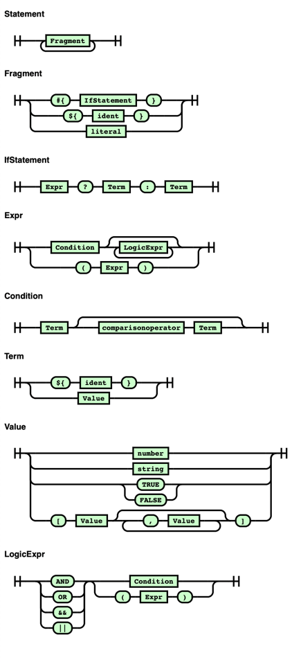

# example-statement-parser

An statement parser with participle.

### Install

```sh
go get github.com/dsxack/example-statement-parser
```

### Usage example

```golang
package main

import (
	"github.com/dsxack/example-statement-parser"
	"log"
)

func Example() {
	stmt := parser.Statement{}
	err := parser.Parse(`#{ ${insecure} ? "http" : "https" }://${domain}/${basepath}`, &stmt)
	if err != nil {
		log.Fatal(err)
	}
}
```

### Example of statements

* `some value 5"`
* `${some.variable}"`
* `#{ true ? "yes" : "no" }`
* `#{ ${insecure} ? ${var1} : ${var2} }`
* `#{ true ? true : false }`
* `#{ 5 ? 10 : 0 }`
* `#{ ${cond1} or ${cond2} ? ${var1} : ${var2} }`
* `#{ ${cond1} || ${cond2} ? ${var1} : ${var2} }`
* `#{ ${cond1} and ${cond2} ? ${var1} : ${var2} }`
* `#{ ${cond1} && ${cond2} ? ${var1} : ${var2} }`
* `#{ ${foo} == "bar" ? ${var1} : ${var2} }`
* `#{ (${cond1} or ${cond2}) and ${cond3} ? ${var1} : ${var2} }`
* `#{ ${cond1} and (${cond2} or ${cond3}) ? ${var1} : ${var2} }`
* `#{ ${cond1} and (${cond2} > 5 or ${cond3}) ? ${var1} : ${var2} }`
* `#{ ${insecure} ? "http" : "https" }://${domain}/${basepath}`

### Parser railway diagram


